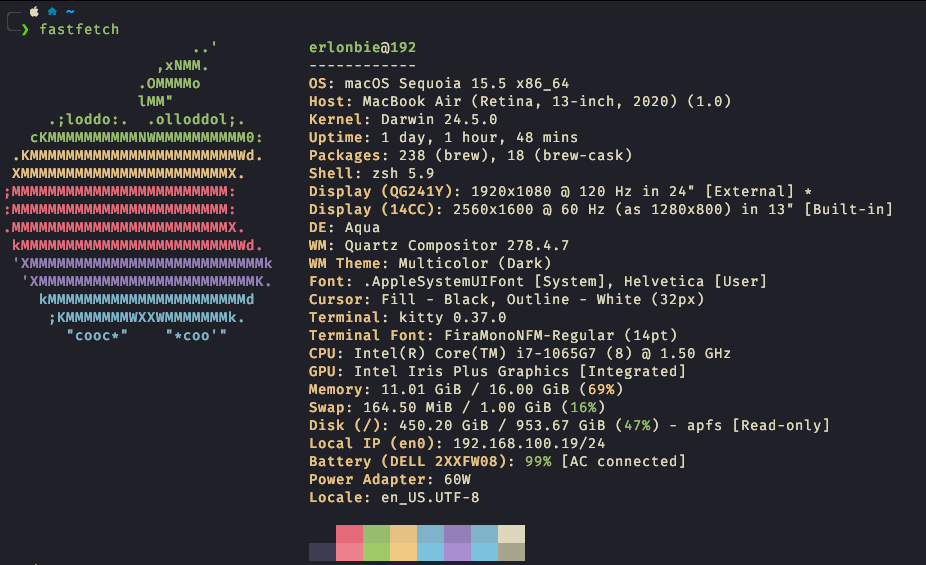

# What do I use?

This page is a collection of the tools, software, and hardware that I use on a daily basis. It serves as a snapshot of my current setup and workflow, which may change over time as I discover new tools or update my preferences. This is an inspiration from the [Uses](https://uses.tech/) project, which showcases the tools and setups of various developers and tech enthusiasts.

# Hardware

## Laptop

-   **Dell XPS i7 9300**: i7-1065G7, 16GB RAM, 1TB SSD, 4K touchscreen display

I run a Hackintosh on this laptop, it is my main machine for development and daily tasks.

## Desktop

-   **Desktop PC**: AMD Ryzen 5 5500, 32GB RAM, 2x512GB SSD, AMD RX 5500 XT
-   **Mini PC**: Lenovo ThinkCentre i7 7th gen, 32gb RAM, 480GB SSD

## Peripherals

-   **Moergo Glove80**: Split ergonomic keyboard for comfortable typing
-   **Planck 40%**: Compact mechanical keyboard for portable use
-   **Monitor**: [ASUS TUF Gaming VG279Q1A](https://www.asus.com/br/displays-desktops/monitors/tuf-gaming/tuf-gaming-vg279q1a/) - 27" Full HD IPS, 165Hz, 1ms MPRT, FreeSync Premium
-   **Mouse**: Logitech Pebble 2 M350s
-   **Headset**: Havit HV-H2002D

## Mobile Devices

-   **Smartphone**: Samsung Galaxy S22, horrible battery but good camera
-   **Tablet**: Samsung Galaxy Tab S9+, an excellent device
-   **Smartwatch**: Samsung Galaxy Watch 4 (44mm), it does the job

## Homelab

### Proxmox Nodes

-   **Desktop PC**: AMD Ryzen 5 5500, 32GB RAM, 2x512GB SSD, AMD RX 5500 XT
-   **Mini PC**: Lenovo ThinkCentre i7 7th gen, 32gb RAM, 480GB SSD

### Nas

-   **NAS Server**: Dell Inspiron 5547 i7 4510U, 8GB RAM running TrueNAS Scale
-   **Storage**: Dock station with SATA HDD/SSD adapter - [link](https://www.aliexpress.us/item/3256805521991251.html)

    This setup provides reliable storage and serves as the backbone of my homelab infrastructure.

# Software

## MacOS

### Development & Coding

-   **[Cursor](https://cursor.sh/)** - AI-powered code editor
-   **[VS Code](https://code.visualstudio.com/)** - Microsoft's code editor
-   **[IntelliJ IDEA](https://www.jetbrains.com/idea/)** - Java IDE
-   **[Postman](https://www.postman.com/)** - API development and testing
-   **[DBeaver](https://dbeaver.io/)** - Universal database tool
-   **[Beekeeper Studio](https://www.beekeeperstudio.io/)** - SQL editor and database manager
-   **[Docker](https://www.docker.com/)** - Containerization platform
-   **[Lens](https://k8slens.dev/)** - Kubernetes IDE
-   **[Hackintool](https://github.com/headkaze/Hackintool)** - Hackintosh configuration tool
-   **[OCAuxiliaryTools](https://github.com/ic005k/OCAuxiliaryTools)** - OpenCore configuration tool
-   **[OpenCore Configurator](https://mackie100projects.altervista.org/opencore-configurator/)** - OpenCore setup tool

### Productivity & Organization

-   **[Obsidian](https://obsidian.md/)** - Knowledge management and note-taking
-   **[Anki](https://apps.ankiweb.net/)** - Spaced repetition flashcard app
-   **[SuperProductivity](https://super-productivity.com/)** - Time tracking and productivity
-   **[Syncthing](https://syncthing.net/)** - File synchronization
-   **[CopyQ](https://hluk.github.io/CopyQ/)** - Advanced clipboard manager
-   **[Shortcuts](https://support.apple.com/guide/shortcuts/welcome/mac)** - macOS native automation

### Window Management & System Tools

-   **[AltTab](https://alt-tab-macos.netlify.app/)** - Enhanced window switching
-   **[Amethyst](https://ianyh.com/amethyst/)** - Tiling window manager
-   **[AutoRaise](https://www.autoraiseapp.com/)** - Auto-raise windows on hover
-   **[BetterDisplay](https://github.com/waydabber/BetterDisplay)** - Display management
-   **[Mac Mouse Fix](https://macmousefix.com/)** - Mouse acceleration and scrolling
-   **[Spaceman](https://github.com/Jaysce/Spaceman)** - Spaces management
-   **[Stats](https://github.com/exelban/stats)** - System monitoring

### Media & Entertainment

-   **[IINA](https://iina.io/)** - Modern video player
-   **[MPV](https://mpv.io/)** - Command-line video player
-   **[VLC](https://www.videolan.org/vlc/)** - Media player
-   **[Camo Studio](https://reincubate.com/camo/)** - Use phone as webcam
-   **[Calibre](https://calibre-ebook.com/)** - E-book management
-   **[Flameshot](https://flameshot.org/)** - Screenshot tool

### Communication & Networking

-   **[Discord](https://discord.com/)** - Voice and text chat
-   **[Telegram](https://telegram.org/)** - Messaging app
-   **[Tailscale](https://tailscale.com/)** - VPN and networking
-   **[LocalSend](https://localsend.org/)** - File sharing over LAN

### Audio & Hardware

-   **[EqMac](https://eqmac.app/)** - Audio equalizer
-   **[Heliport](https://github.com/OpenIntelWireless/HeliPort)** - AirPlay receiver
-   **[VIA](https://caniusevia.com/)** - Keyboard configuration
-   **[Karabiner-Elements](https://karabiner-elements.pqrs.org/)** - Keyboard customizer

### Utilities & Tools

-   **[Arc Browser](https://arc.net/)** - Modern web browser
-   **[ESP Mounter Pro](https://www.esp-mounter.com/)** - Network drive mounting
-   **[Parsec](https://parsec.app/)** - Remote desktop and gaming
-   **[Noevide](https://github.com/Noevide/Noevide)** - Video editor

### Terminal & CLI

-   **[Kitty](https://sw.kovidgoyal.net/kitty/)** - Fast terminal emulator

## Linux

### Desktop Environment & Window Management

-   **[Hyprland](https://hyprland.org/)** - Dynamic tiling Wayland compositor
-   **[Qtile](https://qtile.org/)** - Python-based tiling window manager

### File Management

-   **[Thunar](https://docs.xfce.org/xfce/thunar/start)** - XFCE file manager

### Application Launchers & Menus

-   **[Rofi](https://github.com/davatorium/rofi)** - Window switcher and application launcher
-   **[Wofi](https://hg.sr.ht/~scoopta/wofi)** - Wayland application launcher

### System Notifications

-   **[dunst](https://dunst-project.org/)** - Lightweight notification daemon
-   **[Swaync](https://github.com/ErikReider/SwayNotificationCenter)** - Notification daemon for Sway

### System Bar & Status

-   **[Waybar](https://github.com/Alexays/Waybar)** - Highly customizable Wayland bar

### Input Methods

-   **[fcitx5](https://fcitx-im.org/)** - Input method framework

### System Utilities

-   **[wlogout](https://github.com/ArtsyMacaw/wlogout)** - Logout menu for Wayland

## Mac & Linux CLI

### Package Managers & Language Tools

-   **[brew](https://brew.sh/)** - macOS package manager
-   **[cargo](https://doc.rust-lang.org/cargo/)** - Rust package manager
-   **[bun](https://bun.sh/)** - JavaScript runtime and package manager
-   **[fnm](https://github.com/Schniz/fnm)** - Fast Node.js version manager
-   **[rustup](https://rustup.rs/)** - Rust toolchain installer
-   **[uv](https://github.com/astral-sh/uv)** - Fast Python package installer

### Development & Code Tools

-   **[git](https://git-scm.com/)** - Version control system
-   **[gh](https://cli.github.com/)** - GitHub CLI
-   **[hugo](https://gohugo.io/)** - Static site generator
-   **[hx](https://helix-editor.com/)** - Modern terminal editor
-   **[nvim](https://neovim.io/)** - Neovim editor
-   **[vim](https://www.vim.org/)** - Text editor
-   **[ruff](https://docs.astral.sh/ruff/)** - Fast Python linter
-   **[make](https://www.gnu.org/software/make/)** - Build automation tool

### File Management & Navigation

-   **[eza](https://github.com/eza-community/eza)** - Modern ls replacement
-   **[yazi](https://github.com/sxyazi/yazi)** - Terminal file manager
-   **[find](https://www.gnu.org/software/findutils/)** - File search utility
-   **[rg](https://github.com/BurntSushi/ripgrep)** - Fast grep replacement
-   **[fzf](https://github.com/junegunn/fzf)** - Fuzzy finder
-   **[ncdu](https://dev.yorhel.nl/ncdu)** - Disk usage analyzer

### System & Network Tools

-   **[ssh-copy-id](https://www.openssh.com/)** - Copy SSH keys
-   **[ssh-keygen](https://www.openssh.com/)** - Generate SSH keys
-   **[sshd](https://www.openssh.com/)** - SSH daemon
-   **[sshfs](https://github.com/libfuse/sshfs)** - SSH filesystem
-   **[scp](https://www.openssh.com/)** - Secure copy
-   **[wget](https://www.gnu.org/software/wget/)** - File downloader
-   **[sed](https://www.gnu.org/software/sed/)** - Stream editor

### Container & Cloud Tools

-   **[kubectl](https://kubernetes.io/docs/reference/kubectl/)** - Kubernetes CLI
-   **[kubectx](https://github.com/ahmetb/kubectx)** - Kubernetes context switcher
-   **[helm](https://helm.sh/)** - Kubernetes package manager
-   **[k9s](https://k9scli.io/)** - Kubernetes CLI tool
-   **[talosctl](https://www.talos.dev/latest/talos-guides/management/accessing-the-api/)** - Talos Linux CLI
-   **[vault](https://www.vaultproject.io/)** - HashiCorp Vault CLI

### Database & Data Tools

-   **[sqlite3](https://www.sqlite.org/cli.html)** - SQLite command line
-   **[litecli](https://litecli.com/)** - SQLite CLI with autocompletion
-   **[edgedb](https://www.edgedb.com/docs/cli)** - EdgeDB CLI
-   **[posting](https://github.com/PostgREST/postgrest)** - PostgreSQL REST API

### DevOps & Automation

-   **[ansible-playbook](https://docs.ansible.com/ansible/latest/cli/ansible-playbook.html)** - Ansible automation
-   **[stow](https://www.gnu.org/software/stow/)** - Package manager for dotfiles
-   **[firedbg](https://github.com/firedbg/firedbg)** - Debugging tool

### Terminal & Shell Tools

-   **[tmux](https://github.com/tmux/tmux)** - Terminal multiplexer
-   **[zellij](https://zellij.dev/)** - Terminal workspace
-   **[kitty](https://sw.kovidgoyal.net/kitty/)** - Terminal emulator
-   **[atuin](https://atuin.sh/)** - Shell history manager
-   **[tldr](https://tldr.sh/)** - Simplified man pages

### Media & Content Tools

-   **[ffmpeg](https://ffmpeg.org/)** - Multimedia framework
-   **[yt-dlp](https://github.com/yt-dlp/yt-dlp)** - YouTube downloader
-   **[bob](https://github.com/Mordragat/bob)** - Translation tool

### System Information & Monitoring

-   **[fastfetch](https://github.com/fastfetch-cli/fastfetch)** - System information
-   **[neofetch](https://github.com/dylanaraps/neofetch)** - System information
-   **[fc-list](https://www.freedesktop.org/software/fontconfig/fontconfig-user.html)** - Font listing

### Text Processing & Utilities

-   **[bat](https://github.com/sharkdp/bat)** - Cat with syntax highlighting
-   **[bpython](https://bpython-interpreter.org/)** - Python REPL
-   **[qalc](https://qalculate.github.io/)** - Command-line calculator

### Development Environment

-   **[lazydocker](https://github.com/jesseduffield/lazydocker)** - Docker TUI
-   **[lazygit](https://github.com/jesseduffield/lazygit)** - Git TUI

## Windows

I only use Windows for gaming, most of the time is running Proxmox on another ssd. In the future I might even trying gaming on Linux.
